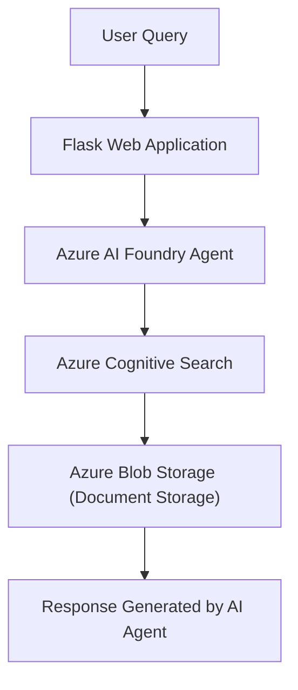

# PitPixie

Developed by: Vanessa Perera

PitPixie is an AI-powered document analysis tool designed to help users explore large Mine Closure Plan documents using natural language queries.

The system allows users to upload documents, ask questions about the content, and receive answers generated by an AI agent. PitPixie uses a Retrieval-Augmented Generation (RAG) architecture built on Microsoft Azure services to retrieve relevant document information and generate responses.

The project was developed as a prototype to explore how artificial intelligence can assist with analysing complex mining documents and improve access to technical information.

## Features:

Chat with an AI agent about uploaded documents.
Upload and analyse large PDF documents.
Filter documents by mine site.
Export chat results (CSV format).
Persistent chat history.
Page number referencing for document responses.
Secure secret management using Azure Key Vault.
Configurable user interface with theme support.

## Technologies Used:

The project uses the following technologies and services.

Backend:
    Python
    Flask

Frontend:
    HTML
    CSS
    JavaScript

Azure Services:
    Azure AI Foundry Agents
    Azure Cognitive Search
    Azure Blob Storage
    Azure Content Understanding
    Azure Key Vault

Other Tools:
    Azure Identity (DefaultAzureCredential / Managed Identity)
    Python Requests library

## Architecture Overview:

PitPixie follows a Retrieval-Augmented Generation (RAG) architecture.
When a user asks a question, the system retrieves relevant document content from Azure Cognitive Search and provides it to an AI agent, which generates a response based on the retrieved information.

Workflow:


Azure Content Understanding is used to detect printed page numbers within documents. This allows the system to map PDF viewer pages to printed page numbers and provide references in responses.

## Project Structure:
```text
PitPixie/
│
├── app.py
├── storage.py
├── content_understanding.py
├── talk_to_agent.py
├── load_secrets.py
│
├── templates/
│   ├── index.html
│   ├── login.html
│   └── about.html
│
├── static/
│   ├── script.js
│   ├── style.css
│   └── Images/
│
├── .env.example
├── .gitignore
├── requirements.txt
├── README.md
└── .deployment
```

## Setup Instructions:

1. Clone the repository
    git clone <repository-url>
    cd PitPixie
2. Create a virtual environment
    python -m venv venv

    Activate the environment:

    Windows:
        venv\Scripts\activate

    Mac/Linux:
        source venv/bin/activate
3. Install dependencies
    pip install -r requirements.txt
4. Configure environment variables

    Copy the example environment file:
        cp .env.example .env

    Edit .env and add your Azure Key Vault URL:
        AZURE_KEY_VAULT_URL=https://<your-keyvault-name>.vault.azure.net/

Secrets such as API keys and connection strings are stored securely in Azure Key Vault.

5. Authenticate with Azure

For local development, login to Azure:
    az login

This allows DefaultAzureCredential() to access Azure services.

6. Run the application
    python app.py

Open the application in your browser:
    http://localhost:5000

## Security:

Sensitive configuration values such as API keys and service credentials are stored in Azure Key Vault.
The application retrieves secrets securely using Azure Identity authentication, rather than storing them directly in the codebase.

## Development Notes:

The project is designed as a prototype AI system for analysing large technical documents.
The system supports document filtering, allowing users to restrict queries to specific documents or mine sites.
Page number references are generated using Azure Content Understanding, which detects printed page numbers within documents to improve traceability of AI responses.

At the current prototype stage, the Content Understanding analyzer returns the printed page number with the highest confidence score for detected values. Because of this behaviour, page referencing may only partially match the exact location of the content in some cases. Further improvements to the analyzer schema or extraction logic may improve page mapping accuracy in future versions.

## Future Improvements:

Possible improvements include:

    Improved page number detection accuracy.
    Enhanced document filtering and search capabilities.
    User authentication and access control.
    Improved UI for document browsing and navigation.
    More advanced document analysis capabilities.

## Acknowledgements:

This prototype was developed within the Shared Environmental Analytics Facility (SEAF) Azure environment.

Technical guidance and support were provided by:
    Brendan Busch (SEAF)
    [@emmasteel](Emma Steel) (Microsoft)
    Emma Burns (Microsoft)
